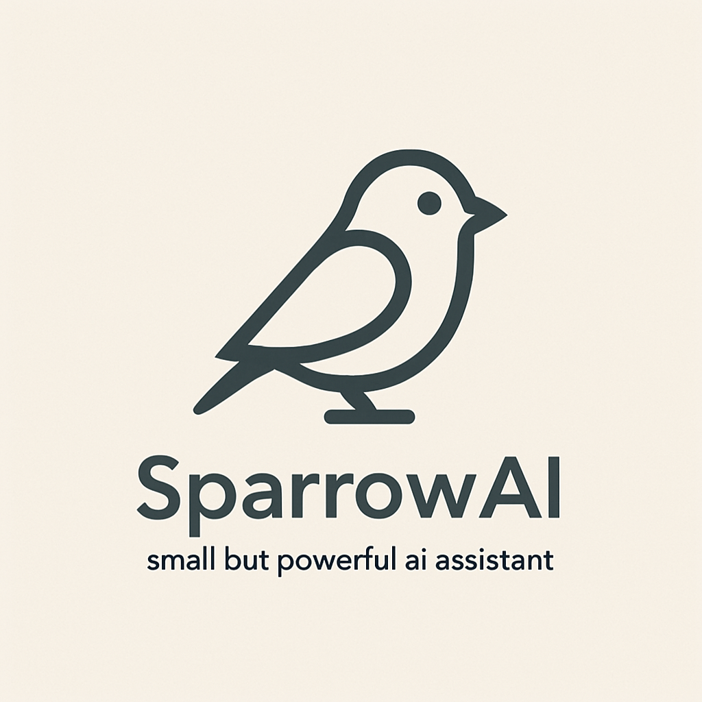

<div align="center">
  
  
  <p align="center">
    <strong>A powerful, privacy-first AI chat application</strong>
    <br />
    Built with Tauri, React, and OpenVINO Model Server(OVMS) for lightning-fast local AI inference on Intel AIPC
    <br />
    <br />
    <a href="#-quick-start"><strong>Get Started »</strong></a>
    ·
    <a href="#-features">Features</a>
    ·
    <a href="#-screenshots">Screenshots</a>
    ·
    <a href="https://github.com/zhengchy95/SparrowAI/issues">Report Bug</a>
    ·
    <a href="https://github.com/zhengchy95/SparrowAI/issues">Request Feature</a>
  </p>

  <p align="center">
    
    
    
    
    
  </p>
</div>

## 🚀 About SparrowAI

SparrowAI is a modern desktop application that brings powerful AI capabilities directly to your computer. Unlike cloud-based solutions, SparrowAI runs everything locally using Intel's OpenVINO Model Server for optimized performance, ensuring your conversations remain completely private.

### 🎯 Key Highlights

- **🔒 100% Local** - All processing happens on your device
- **⚡ Optimized Performance** - Powered by Intel OpenVINO for maximum efficiency
- **🧠 RAG Support** - Upload documents for context-aware conversations
- **🎨 Modern Interface** - Beautiful Material-UI design with dark/light themes

## ✨ Features

### 💬 **Intelligent Conversations**

- Real-time streaming responses with performance metrics
- Multi-session chat management with persistent history
- Customizable system prompts and generation parameters
- Context-aware conversations with document upload support
- MCP (Model Context Protocol) integration for external tool access

### 📚 **Document Intelligence (RAG)**

- Upload PDF, DOCX, XLSX files for enhanced context
- Automatic document processing and embedding generation
- Intelligent document chunking and retrieval
- File-based document management with expandable previews

### 🤖 **Advanced Model Management**

- Browse and download models from Hugging Face Hub
- Automatic BGE model installation for RAG functionality
- Smart model pre-selection based on OVMS status
- Seamless model switching with configuration updates
- MCP server management and configuration

### ⚡ **High-Performance Infrastructure**

- Intel OpenVINO Model Server integration
- Automatic OVMS download and configuration
- Hardware acceleration (CPU/GPU/Neural Processing Unit)
- Efficient memory management and resource optimization

### 🎨 **Polished User Experience**

- Material-UI design system with smooth animations
- Collapsible sidebar with session management
- Real-time initialization progress tracking
- Comprehensive settings with theme customization

## 📸 Screenshots

> _Coming Soon - Beautiful interface screenshots showcasing the chat experience, document management, and model browser_

## 🚀 Quick Start

### Prerequisites

Make sure you have the following installed:

- **Node.js** 18+ ([Download](https://nodejs.org/))
- **Rust** latest stable ([Install](https://rustup.rs/))
- **pnpm** package manager (`npm install -g pnpm`)

### Installation

1. **Clone the repository**

   ```bash
   git clone https://github.com/DavidOzc/SparrowAI.git
   cd SparrowAI
   ```

2. **Install dependencies**

   ```bash
   pnpm install
   ```

3. **Run in development mode**

   ```bash
   pnpm tauri dev
   ```

4. **Build for production**
   ```bash
   pnpm tauri build
   ```

### First Launch

1. **Initialization** - SparrowAI will automatically:

   - Download OpenVINO Model Server
   - Install required BGE models for RAG
   - Create configuration files

2. **Download Models** - Visit the Models page to:

   - Browse Hugging Face OpenVINO models
   - Download your preferred language models
   - Models are stored in `~/.sparrow/models/`

3. **Start Chatting** - Select a model and begin conversations!

## 🧠 Core Technologies

### Frontend Stack

- **React 18** - Modern UI with hooks and concurrent features
- **Material-UI v7.2** - Comprehensive component library
- **Zustand** - Lightweight state management
- **Vite 6** - Lightning-fast development and builds

### Backend Stack

- **Rust** - Memory-safe systems programming
- **Tauri 2.0** - Secure desktop app framework
- **Tokio** - Asynchronous runtime
- **OpenVINO Model Server** - Optimized AI inference

### AI & ML Stack

- **OpenVINO** - Intel's AI optimization toolkit
- **BGE Embeddings** - Best-in-class text embeddings
- **Sled Database** - High-performance vector storage
- **Document Processing** - PDF, DOCX, XLSX support
- **MCP Integration** - Model Context Protocol for external tools

## 📁 Project Structure

```
SparrowAI/
├── src/                      # React frontend
│   ├── components/          # UI components
│   │   ├── ChatPage.jsx    # Main chat interface
│   │   ├── DocumentsPage.jsx # RAG document manager
│   │   ├── ModelsPage.jsx   # Model browser
│   │   ├── McpPage.jsx     # MCP server management
│   │   ├── SettingsDialog.jsx # Application settings
│   │   └── Sidebar.jsx     # Navigation sidebar
│   ├── store/              # Zustand state stores
│   │   ├── useAppStore.jsx # Application state
│   │   └── useChatStore.jsx # Chat state
│   └── hooks/              # Custom React hooks
├── src-tauri/              # Rust backend
│   ├── src/
│   │   ├── lib.rs          # Main application
│   │   ├── ovms.rs         # OVMS integration
│   │   ├── chat.rs         # Chat sessions
│   │   ├── huggingface.rs  # HF Hub integration
│   │   ├── mcp/            # MCP integration
│   │   │   ├── client.rs   # MCP client
│   │   │   ├── commands.rs # MCP commands
│   │   │   └── config.rs   # MCP configuration
│   │   └── rag/            # RAG pipeline
│   │       ├── documents.rs
│   │       ├── embeddings.rs
│   │       ├── search.rs   # Vector search
│   │       └── vector_store.rs
├── public/                 # Static assets
└── README.md              # You are here!
```

## ⚙️ Configuration

### Data Directory

SparrowAI stores all data in your user profile:

- **Windows**: `%USERPROFILE%\.sparrow\`

### Directory Structure

```
.sparrow/
├── models/                 # Downloaded AI models
│   └── OpenVINO/          # OpenVINO optimized models
├── ovms/                  # Model server installation
├── vector_store/          # RAG document database
└── chat_sessions.json     # Conversation history
```

## 🎯 Usage Guide

### Model Recommendations

| Model                           | Size | Performance | Use Case                  |
| ------------------------------- | ---- | ----------- | ------------------------- |
| `Phi-3.5-mini-instruct-int4-ov` | ~2GB | ⚡⚡⚡      | Quick responses, coding   |
| `Qwen2.5-1.5B-Instruct-int4-ov` | ~1GB | ⚡⚡⚡      | Lightweight, multilingual |
| `Llama-3.1-8B-Instruct-int4-ov` | ~5GB | ⚡⚡        | Complex reasoning         |

### RAG Document Support

Upload these document types for enhanced conversations:

- **PDF** - Research papers, books, manuals
- **DOCX** - Word documents, reports
- **XLSX** - Spreadsheets, data tables

### Advanced Settings

- **System Prompts** - Customize AI behavior and personality
- **Generation Parameters** - Fine-tune temperature, top-p, max tokens
- **RAG Settings** - Enable/disable retrieval augmented generation
- **Performance** - Monitor tokens per second and inference metrics

## 🔧 Development

### Available Scripts

```bash
# Development
pnpm dev              # Start frontend dev server
pnpm tauri dev        # Launch Tauri development mode

# Building
pnpm build           # Build frontend for production
pnpm tauri build     # Create distributable app

# Testing
cd src-tauri && cargo test    # Run Rust tests
cd src-tauri && cargo check   # Check Rust code
```

### Contributing Guidelines

We welcome contributions! Please:

1. **Fork** the repository
2. **Create** a feature branch: `git checkout -b feature/amazing-feature`
3. **Commit** your changes: `git commit -m 'Add amazing feature'`
4. **Push** to the branch: `git push origin feature/amazing-feature`
5. **Open** a Pull Request

### Code Standards

- Follow Rust formatting: `cargo fmt`
- Apply Javascript formatting with prettier default config
- Update documentation for new features

## 🔍 Troubleshooting

<details>
<summary><strong>🔧 Common Issues</strong></summary>

### OVMS Fails to Start

- Ensure Windows Defender/antivirus allows the app
- Check ports 1114-1115 are available
- Verify sufficient disk space (5GB+ recommended)

### Model Download Issues

- Check internet connection stability
- Verify Hugging Face Hub accessibility
- Try downloading smaller models first
- Clear browser cache if using web interface

### Performance Problems

- Monitor system resources (CPU/RAM/GPU)
- Use int4 quantized models for better performance
- Reduce max_tokens in settings
- Close unnecessary applications

### RAG Not Working

- Ensure BGE models are downloaded
- Check document upload file formats
- Verify sufficient storage space
- Try smaller documents first

</details>

## 📊 Performance Metrics

| Metric                  | Typical Range      | Optimized Hardware |
| ----------------------- | ------------------ | ------------------ |
| **Startup Time**        | 3-5 seconds        | < 2 seconds        |
| **Memory Usage**        | 200MB + model size | 150MB + model size |
| **Inference Speed**     | 5-30 tokens/sec    | 20-100+ tokens/sec |
| **Document Processing** | 1-5 MB/sec         | 5-15 MB/sec        |

_Performance varies by hardware configuration and model size_

## 🔒 Privacy & Security

- **🏠 Local-First**: All processing happens on your device
- **🚫 No Telemetry**: Zero data collection or tracking
- **🔓 Open Source**: Complete transparency in code and behavior
- **🛡️ Secure**: Tauri's security model protects against vulnerabilities
- **📁 Data Control**: You own and control all conversations and documents

## 📄 License

This project is licensed under the **MIT License** - see the [LICENSE](LICENSE) file for details.

## 🙏 Acknowledgments

Special thanks to these incredible projects that make SparrowAI possible:

- **[Intel OpenVINO Model Server](https://github.com/openvinotoolkit/model_server)** - Local LLM Provider
- **[Tauri](https://tauri.app/)** - Secure cross-platform desktop framework
- **[Hugging Face](https://huggingface.co/)** - Democratizing access to AI models
- **[Material-UI](https://mui.com/)** - Beautiful React component library

---

<div align="center">
  
  **Built with ❤️ by the SparrowAI team**
  
  <p>
    <a href="https://github.com/zhengchy95/SparrowAI">⭐ Star on GitHub</a> •
    <a href="https://github.com/zhengchy95/SparrowAI/issues">🐛 Report Issues</a> •
    <a href="https://github.com/zhengchy95/SparrowAI/discussions">💬 Discussions</a>
  </p>
  
  <sub>Made possible by the open-source community 🌟</sub>
  
</div>
